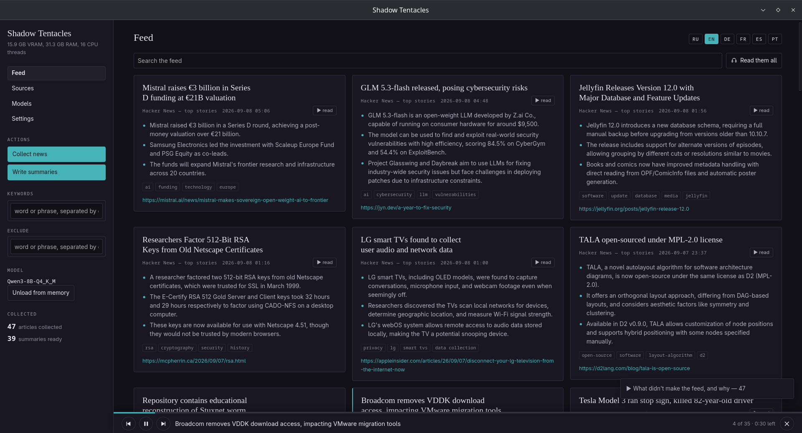
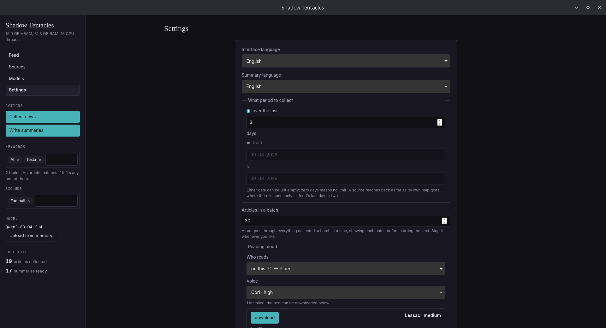
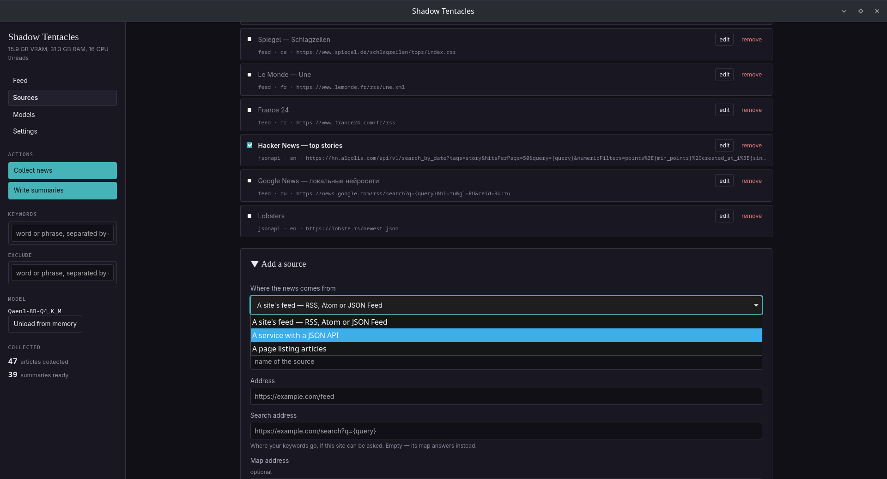
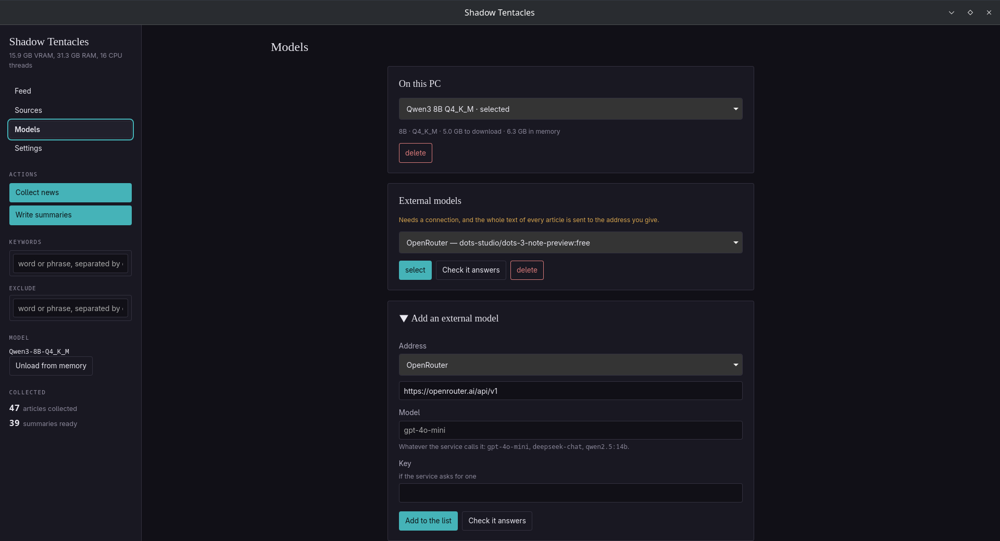
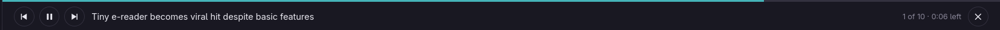

<div align="center">


# Shadow Tentacles

**Follow a subject across the papers without reading them.**

Name your sources, your dates and your words. Shadow Tentacles brings back every
article that matches, shortens each one, and reads them to you.

[](LICENSE)
[](#install)
[](docs/BUILDING.md)



</div>

---

## What it does

A news reader that does the reading. It goes to the publishers themselves, takes
everything they published in the days you asked about, keeps what matches your
keywords, and writes each article down to something you can take in at a glance.
Then it reads the lot aloud, one article after another, while you get on with
something else.

- **Complete, not a sample.** Every run asks the whole question again. A feed
  offers thirty items from the last day or two; the sitemaps a publisher keeps
  for search engines list everything, with dates. Measured on the BBC: thirty
  items in the World feed, more than a thousand in the news sitemaps over the
  same two days.
- **Your words, not a category.** Keywords match on stems, so `санкции` finds
  `санкций`. Group them, exclude with a leading minus, and the run tells you what
  it dropped and why.
- **Local by default, a service by choice.** Summaries are written on this
  machine unless you say otherwise. Point it at any service that speaks the
  OpenAI chat completions shape if you would rather, and the screen that offers
  it says exactly what gets sent.
- **Read aloud.** Press the headphones and the feed becomes a broadcast: article
  after article, with a pinned bar showing what is playing and what is next.
- **Seven languages in the window, six for summaries.** Wanting your briefs in
  English does not mean wanting to read the buttons in it.

## Install

Download an installer from the
[releases page](https://github.com/BranchRevolt/Shadow-Tentacles/releases).

| Platform | File |
|---|---|
| Linux | `.AppImage`, or `.deb` for Debian and Ubuntu |
| Windows | `.exe` installer |
| macOS | `.dmg` for Apple silicon or Intel |

To build it yourself, see [docs/BUILDING.md](docs/BUILDING.md).

### The releases are not signed

Signing costs money that an open project has no reason to spend, so expect the
operating system to object:

- **Windows** shows a SmartScreen warning. Choose "More info", then "Run anyway".
  Antivirus software sometimes objects to the packaging as well.
- **macOS** refuses a double click. Right click the app and choose Open, or run
  `xattr -d com.apple.quarantine` on it.
- **Linux** says nothing.

Checksums are published with each release. Check them if you care to.

## Getting started

1. **Open it.** The first run offers a model suited to your hardware. Accept it,
   or pick another under **Models**.
2. **Say what you are following.** Under **Settings**, type your keywords and set
   how far back to look.
3. **Press collect.** The sources are polled, the pages are fetched, and what is
   not an article is turned away with a reason.
4. **Press summarize.** It goes through everything pending, batch after batch, and
   the counter runs to the end rather than stopping at thirty.
5. **Press the headphones.** The feed reads itself to you from the top.



## Where the articles come from

A source is reached in as many ways as it supports, and the results are merged.

**Its feed** is read every time: about thirty items from the last day or two,
carrying the summary the publisher wrote.

**Its sitemap** is the complete answer, and it is what makes a keyword a search
rather than a filter over leftovers. Publishers keep sitemaps for search engines,
so they list everything published with the date of each, and the news sitemaps
carry the headline too. It is found on its own through `robots.txt`.

**A few sources answer a question directly**, and those carry a `search_url` with
`{query}` in it. Hacker News ships that way in the starter configuration, written
in terms anyone can use: an address with the placeholders the service filters on,
a note of what it calls its fields, and a header if it wants a token. A service
that needed its own entry in the program would be a service nobody else could
add.

Past a sitemap's reach a word can only be recognized where the address spells it
out. The run says so rather than pretending it looked everywhere.



## Summaries: on this machine, or at a service

Summaries are written locally unless you say otherwise. Under **Models** you can
instead point the program at any service that speaks the OpenAI chat completions
shape: OpenAI itself, OpenRouter, LM Studio, Ollama, a llama.cpp server on the
next desk. That is a different promise, and the screen says so where the choice
is made, because the full text of every article is sent to the address you give.

Choosing the model is the whole of the choice. There is no second switch to
forget about.



## Reading aloud

Press the headphones on a card and the feed becomes a broadcast. A pinned bar
along the foot of the window says what is being read, how much of it is left, and
what number it is in the queue.



Two engines. The local one runs entirely on this machine: espeak-ng turns the
text into phonemes and a Piper voice speaks them. The other is Microsoft Edge's
reading service, which sounds better and sends the text to Microsoft. It is off
until you turn it on, and the screen that offers it says where the text goes.

Portuguese is Brazilian where it is spoken aloud, because the published voices
are Brazilian. Every voice is read with the espeak dialect it was trained on
rather than with its language's, which is what keeps a Mexican voice from
speaking with a Castilian accent.

## Languages

| | |
|---|---|
| **Summaries** | Russian, English, German, French, Spanish, Portuguese, in any direction |
| **The window** | English, Chinese, French, German, Portuguese, Russian, Spanish |

The two are separate settings on purpose.

## Hardware

The model is chosen for the machine on the first run and can be changed at any
time in the window. Both the parameter count and the weight precision matter, and
they cost roughly the same memory in different proportions.

| Model | Download | In memory | For a card with |
|---|---|---|---|
| Qwen3 4B Q4_K_M | 2.4 GB | ~4.0 GB | 6 GB |
| Qwen3 4B Q8_0 | 4.0 GB | ~5.8 GB | 8 GB |
| **Qwen3 8B Q4_K_M** | 4.7 GB | ~6.5 GB | **8 GB, the default** |
| Qwen3 8B Q8_0 | 8.2 GB | ~10.3 GB | 12 GB |
| Qwen3 14B Q4_K_M | 9.0 GB | ~11.5 GB | 16 GB |

Measured across languages, more parameters buy accuracy on names and established
terms, while more bits buy grammar. 8B at four bits was the best of the four on
both counts, at a cost mainstream hardware can meet.

GPU acceleration is on by default: Vulkan on Linux and Windows, Metal on macOS. A
machine without a usable GPU still works, at roughly a minute per article instead
of ten seconds, but the Vulkan loader itself has to be present for the program to
start at all. The `.deb` depends on `libvulkan1` and the AppImage carries the
loader inside it, so this matters only when building from source.
`shadow-tentacles doctor` reports what was found.

## Where things live

```
~/.config/shadow-tentacles/sources.toml     sources and settings
~/.local/share/shadow-tentacles/            database and models
```

`sources.toml` is meant to be readable and shareable: hand a set of feeds to
someone else by handing them the file. The window writes to the same file and
rewrites it whole when it does, so comments added by hand do not survive a change
made in the window.

Where the models go is a setting, chosen in the window under **What is kept on
disk**. A GGUF is several gigabytes and the disk with your home directory on it
is not always the roomy one. If a model is already on disk from another program,
point that setting at its folder rather than downloading a second copy.

## Without a window

Every job the window does can be run headless.

```sh
shadow-tentacles                  # open the window
shadow-tentacles fetch            # poll every source, store what is new
shadow-tentacles summarize        # summarize what is pending
shadow-tentacles show             # print the summaries
shadow-tentacles run              # fetch, then summarize, then show
shadow-tentacles speak            # read the latest summaries into a WAV file
shadow-tentacles sources          # list the configured sources
shadow-tentacles model list       # the catalog, and what is on disk
shadow-tentacles doctor           # hardware, paths, and what is in the database
```

`shadow-tentacles help` lists the options.

## Documentation

- [Building from source](docs/BUILDING.md), the toolchain and the platform notes
- [How it is put together](docs/ARCHITECTURE.md), the path of an article through
  the code
- [Third party notices](THIRD-PARTY-NOTICES.md), every component and its license

## License

GPL-3.0-or-later. See [LICENSE](LICENSE).

Not only a preference: espeak-ng, which turns text into the phonemes a voice
reads, is GPL-3-or-later and is compiled into the binary.
[THIRD-PARTY-NOTICES.md](THIRD-PARTY-NOTICES.md) lists every component and its
license, and separates what ships inside the program from what it downloads when
you ask for it.
